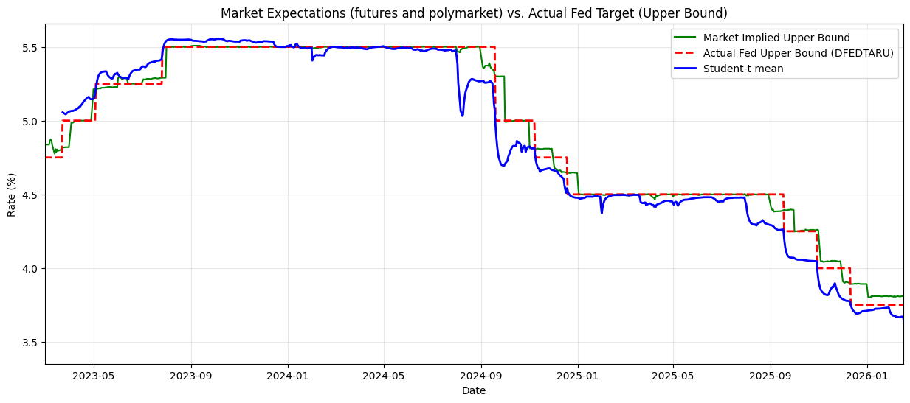

# Extracting Continuous Fed Rate Expectations from Polymarket

University data science project that turns **discrete Polymarket FOMC contracts** into a **continuous market-implied policy rate** (a “shadow rate”), then compares that signal with CME Federal Funds futures.

Polymarket prices binary tokens such as “25 bps cut” or “no change.” Those prices are treated as risk-neutral probabilities over rate bins. Gaussian and Student-t distributions are fitted to the bins each day, producing a time series of expected rates and uncertainty. The same idea is extended across several upcoming meetings to build a forward curve, which is then decomposed with PCA.

**Main result:** the Student-t fit beats the Gaussian on AIC (average AIC −20.18 vs −18.02). Relative to CME Fed Funds futures, the Polymarket-implied rate is more accurate as the FOMC date approaches (e.g. 4.6 bps vs 11.1 bps RMSE in the last 0–3 days).




## Repository layout

Run the notebooks **in order**, from this folder, so they can find the CSV files sitting next to them.

| File | What it does |
| --- | --- |
| [`01_data_collection.ipynb`](01_data_collection.ipynb) | Downloads Polymarket CLOB prices (Gamma + CLOB APIs), FRED target-rate history, and CME futures via Yahoo Finance. Parses contract bins and writes the panel CSVs. |
| [`02_distribution_fitting.ipynb`](02_distribution_fitting.ipynb) | Front-month Gaussian and Student-t CDF fits (L-BFGS-B), EWMA smoothing, KDE comparison, AIC. |
| [`03_forward_curve_and_pca.ipynb`](03_forward_curve_and_pca.ipynb) | Fits implied rates for several future meetings, stacks them into a forward curve, and runs PCA (Level / Slope / Curvature). |
| [`04_cme_comparison_and_calibration.ipynb`](04_cme_comparison_and_calibration.ipynb) | Converts CME Fed Funds futures to an implied upper bound, RMSE vs FOMC outcomes, and PIT calibration tests. |
| [`report/report.md`](report/report.md) | Course report (methods, results, figures). |

Processed datasets are included, so you can skip the API download and start at notebook 02.

## Data files

| File | Description |
| --- | --- |
| `fed_rates_fred.csv` | Daily Fed funds **upper bound** from FRED (`DFEDTARU`). |
| `fed_rates_and_futures.csv` | FRED effective rate, target bounds, and CME-implied rate (`ZQ=F`). |
| `polymarket_fed_predictions_parsed_uncleaned.csv` | All listed FOMC contracts (overlapping forward meetings). Used for the forward curve. |
| `polymarket_fed_predictions_parsed.csv` | **Front-month only**: the nearest upcoming FOMC meeting on each date. |
| `daily_fed_rate_distribution_gaussian_estimation.csv` | Front-month panel plus fitted Gaussian $\mu, \sigma$ (raw and EWMA-smoothed). |
| `daily_fed_rate_distribution_student_t_estimation.csv` | Same panel plus Student-t $\mu, \sigma, \nu$. |

Coverage is roughly April 2023–April 2026. Earlier Polymarket contracts are dropped because rules were inconsistent and liquidity was thin.

**Contract regimes** (see the report for the math):

- **Regime 1** (before May 2025 contracts): strict inequality bins; the “no change” bin is given a small width so a continuous density can be fitted.
- **Regime 2** (May 2025 onward): nearest-neighbor 25 bp rounding, so interior bins are 25 bp wide and centered on the strike.

## How to run

From this folder (the repository root):

```bash
python -m venv .venv
# Windows
.venv\Scripts\activate
pip install -r requirements.txt
jupyter notebook
```

Then open the notebooks in order. Jupyter’s working directory should be this folder so `pd.read_csv("...")` finds the CSV files next to the notebooks.

Re-downloading prices is optional. Notebook 01 calls:

- Polymarket [Gamma API](https://docs.polymarket.com) (event metadata) and [CLOB API](https://docs.polymarket.com/#clob) (daily prices)
- FRED via `pandas-datareader`
- Yahoo Finance (`yfinance`) for `ZQ=F`

No API keys are stored in this repo. FRED access may require a free [FRED API key](https://fred.stlouisfed.org/docs/api/api_key.html) depending on your `pandas-datareader` version.

## Method in brief

1. Treat each Polymarket outcome price $\pi_t(E_i)$ as $\mathbb{Q}(E_i \mid \mathcal{F}_t)$, and as a close proxy for the physical probability.
2. Map outcome labels to rate bins $B_i = [l_i, u_i)$, including unbounded tails.
3. Fit $\hat p_i(\theta) = F(u_i;\theta) - F(l_i;\theta)$ by least squares on the CDF (Gaussian $\theta=(\mu,\sigma)$, Student-t $\theta=(\mu,\sigma,\nu)$).
4. Smooth $\theta_t$ with a 5-day EWMA.
5. For later meetings, interpret each contract as a **marginal** shift and build $\mathbb{E}_t[R_n] = R_0 + \sum_k \mathbb{E}_t[\Delta R_k]$.
6. PCA on day-to-day changes of the first three forwards recovers Litterman–Scheinkman-style Level (81%), Slope (13%), and Curvature (6%) factors.

## Key figures

| Figure | File |
| --- | --- |
| December 2025 contract probabilities | [`report/images/fed_decision_2025_implied_probs.png`](report/images/fed_decision_2025_implied_probs.png) |
| Gaussian implied-rate time series | [`report/images/gaussian_dist_TS.png`](report/images/gaussian_dist_TS.png) |
| Student-t implied-rate time series | [`report/images/student_t_timeseries.png`](report/images/student_t_timeseries.png) |
| Multi-meeting forward curve | [`report/images/forward_plot.png`](report/images/forward_plot.png) |
| PCA loadings | [`report/images/PCA_loading.png`](report/images/PCA_loading.png) |
| Polymarket vs CME | [`report/images/tradfi_vs_poly_upperbound.png`](report/images/tradfi_vs_poly_upperbound.png) |

## Course context

Written for a university data science course. AI tools were used only for coding help and wording; methods and conclusions are the author’s (see the declaration in the report).
